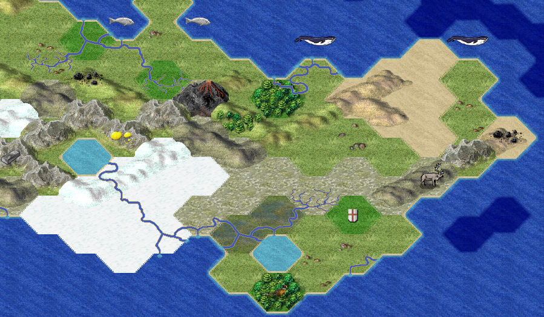
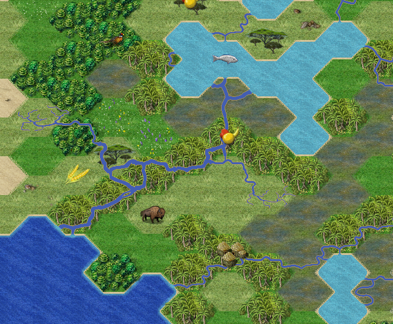

# freecivstuff
Tileset &amp; ruleset for freeciv

This repository is for playing freeciv with more terrain types. Such as "arctic hills" and "desert hills".  This gives more opportunities for nice looking terrains, as it is now possible to have a hill in a desert or polar region - without getting an unrealistic green hill there. A green hill is not merely a bad fit visually, it also ruins the gameplay by providing too nice terrain in an otherwise barren region. 

Having more terrain types makes a custom ruleset necessary, as the ruleset specifies the terrain types.  The custom ruleset here is the civ2civ3 rules, with more terrain added.

The extra terrain types is supported by the terrain generator in freeciv 3.1  They are also supported by my ["tergen"](https://github.com/Hafting/tergen) terrain generator. The terrain graphics is based on the toonhex tileset, and is therefore named toonhex+.

To use this, copy the files and folders into your freeciv folder. Such as /usr/share/freeciv/ on Linux.

There are two ways to specify the toonhex+ tileset. Those using the command line, can start the game like this:
freeciv-gtk3 -t toonhex+

Those preferring GUI solutions, start freeciv and open "client settings". Select graphics, and set tileset(Iso-Hex) to "toonhex+"

Either way, start a game and choose the "hh" ruleset. You will get these extra terrain tiles:
- desert hills
- arctic hills
- tundra hills
- forest hills
- jungle hills
- volcanoes
- big rivers

## Hills and volcanoes

The various hills are much like their flat land counterparts, but they can be mined like any other hill, and have move cost like a hill. Arctic, desert and tundra hills are barren. The forest hill have shield bonus like a forest, and more if mined. Hill graphics are based on the toonhex hill, with the color changed or some trees added.

The volcanoes are blackened mountains, some with lava flows.  Volcanoes do not support roads, impeding transport.  Like mountains, they produce no food. But they can be worked and mined for the unusual stuff they bring to the surface.

## Rivers, big and small

	
The big lake has a big river to the sea. The big river has a couple of small side rivers. There are also some other small rivers.

The well-known freeciv river, is the "small" river.  Small rivers admit triremes, but not the bigger ships.

Big rivers are visually bigger. These rivers allow all ships, making some lakes and inland cities reachable by ship. 
